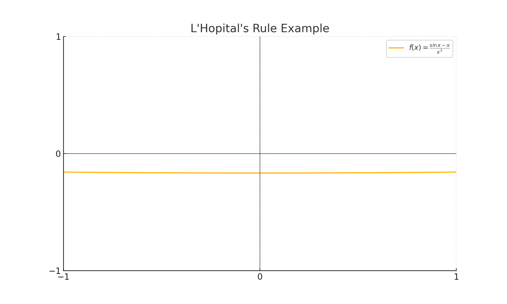

# Applications of Derivatives

## Key Ideas

- Derivatives help us understand how a function behaves — where it increases or decreases, peaks, curves, and flattens out.
- Applications of derivatives include:
  - Identifying maxima and minima
  - Understanding curve shapes
  - Solving motion and rate problems
  - Optimizing values
  - Approximating roots of equations

---

## Max and Min Values

A function’s **local maximum** or **minimum** occurs at **critical points**, where the derivative is zero or undefined.

We find absolute extrema by checking critical points and endpoints.

### Example

Find and classify the critical points of $f(x) = x^3 - 6x^2 + 9x + 2$.

**Solution**:

$$
f'(x) = 3x^2 - 12x + 9 = 3(x - 1)(x - 3)
$$

Critical points: $x = 1$, $x = 3$. Use the First Derivative Test to classify.

### Practice Problems

1. Find the critical points of $f(x) = x^4 - 4x^2$.
2. Find absolute extrema of $f(x) = x^2 - 4x + 3$ on $[0, 5]$.
3. Determine local max/min for $f(x) = rac{1}{x^2 + 1}$.

---

## Rolle's Theorem

If $f$ is continuous on $[a, b]$, differentiable on $(a, b)$, and $f(a) = f(b)$, then there exists $c \in (a, b)$ where $f'(c) = 0$.

### Example

Let $f(x) = x^2 - 4x + 4$ on $[2, 4]$. Since $f(2) = f(4) = 0$, Rolle’s Theorem applies.

$$
f'(x) = 2x - 4 \Rightarrow f'(2) = 0
$$

### Practice Problems

1. Verify Rolle’s Theorem for $f(x) = \cos x$ on $[0, 2\pi]$.
2. Find all $c$ such that $f'(c) = 0$ for $f(x) = x^3 - 3x$ on $[-\sqrt{3}, \sqrt{3}]$.

---

## Mean Value Theorem (MVT)

If $f$ is continuous on $[a, b]$ and differentiable on $(a, b)$, then:

$$
\exists\ c \in (a, b) 	ext{ such that } f'(c) = rac{f(b) - f(a)}{b - a}
$$

### Example

For $f(x) = x^2$ on $[1, 3]$, average rate:

$$
rac{f(3) - f(1)}{3 - 1} = rac{9 - 1}{2} = 4
$$

Find $c$: $f'(x) = 2x = 4 \Rightarrow c = 2$

### Practice Problems

1. Verify MVT for $f(x) = \sqrt{x}$ on $[1, 4]$.
2. Find $c$ for $f(x) = \ln x$ on $[1, e]$.

---

## How Derivatives Affect Graph Shape

- If $f'(x) > 0$, the function is **increasing**
- If $f'(x) < 0$, it's **decreasing**
- If $f''(x) > 0$, it's **concave up**
- If $f''(x) < 0$, it's **concave down**
- **Inflection points** occur where $f''(x)$ changes sign

### Practice Problems

1. Find intervals of concavity for $f(x) = x^4 - 4x^2$.
2. Identify all inflection points for $f(x) = x^3 - 3x$.

---

## Indeterminate Forms and L'Hôpital's Rule

When direct substitution gives an indeterminate form like $rac{0}{0}$ or $rac{\infty}{\infty}$:

$$
\lim_{x 	o a} rac{f(x)}{g(x)} = \lim_{x 	o a} rac{f'(x)}{g'(x)} \quad 	ext{(if limit exists)}
$$

### Practice Problems

1. Evaluate: $\lim_{x 	o 0} rac{\sin x - x}{x^3}$
2. Evaluate: $\lim_{x 	o \infty} rac{\ln x}{x}$

---

## Curve Sketching

Use the first and second derivatives to identify:
- Increasing/decreasing intervals
- Local extrema
- Concavity
- Inflection points
- Asymptotes

### Practice Problems

1. Sketch $f(x) = x^3 - 3x^2 + 2$ using first and second derivatives.
2. Label extrema and inflection points on $f(x) = rac{1}{x}$.

---

## Related Rates

Use implicit differentiation to relate changing quantities over time.

### Practice Problems

1. A balloon rises at 5 ft/s while a person walks away at 3 ft/s. How fast is the distance between them increasing when 40 ft apart?
2. A 10 ft ladder slides down a wall. If the bottom moves out at 2 ft/s, how fast is the top falling when the bottom is 6 ft from the wall?

---

## Optimization

Use critical points and endpoints to solve problems that ask for a maximum or minimum.

### Practice Problems

1. Find dimensions of a rectangle with fixed perimeter 40 m to maximize area.
2. Maximize volume of a box made by cutting squares from corners of a 10×10 square.

---

## Newton’s Method

Use iteration to approximate solutions to $f(x) = 0$.

$$
x_{n+1} = x_n - rac{f(x_n)}{f'(x_n)}
$$

### Practice Problems

1. Approximate root of $f(x) = x^3 - x - 1$ using $x_0 = 1.5$.
2. Use Newton’s Method to estimate $\sqrt{5}$ from $f(x) = x^2 - 5$.

---

## Tutor’s Tip

Each concept above is just a different **use case for derivatives**. Always ask:
- Is this a rate or slope?
- Do I need to maximize/minimize something?
- Am I tracking change in time?

The derivative is your **most powerful tool** — understand when and how to apply it.
