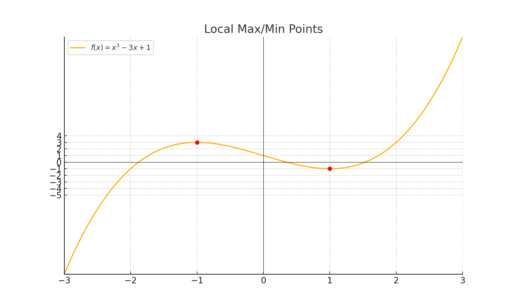
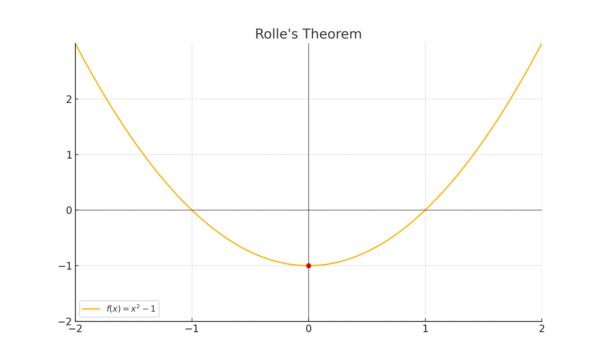
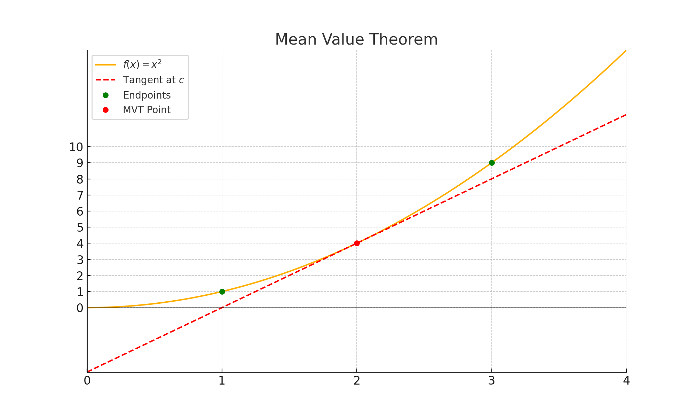
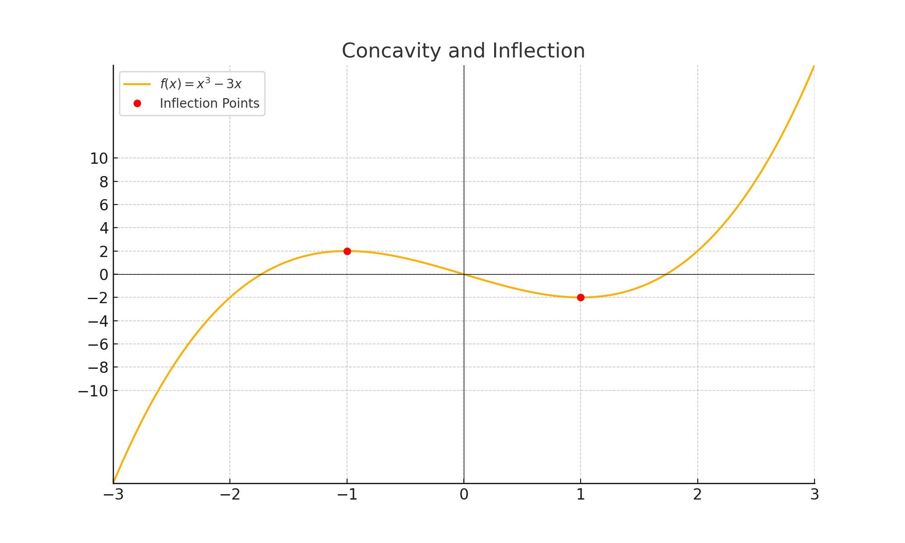
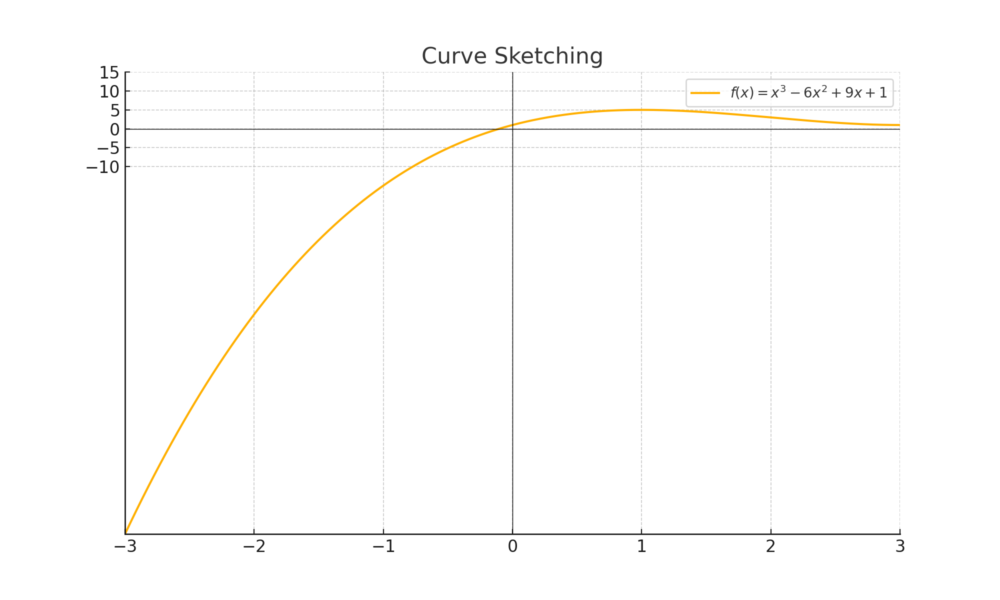
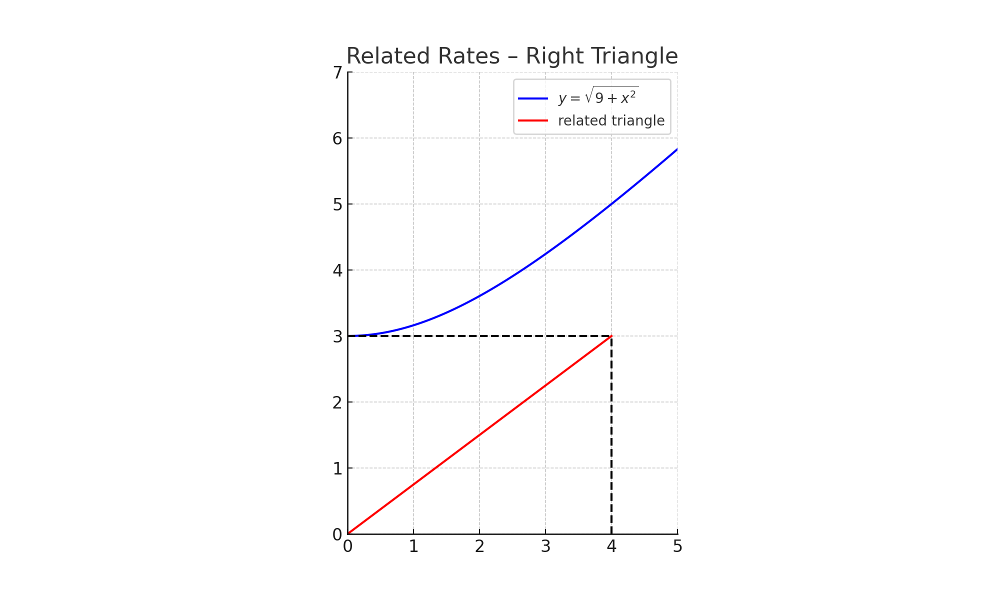
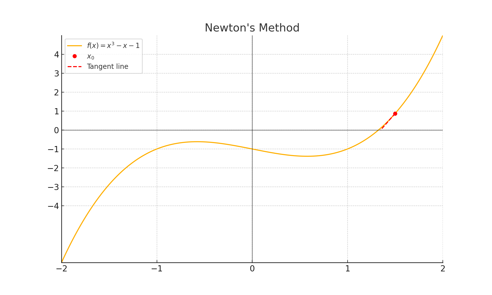

# Applications of Derivatives

## Key Ideas

- Derivatives help us understand how a function behaves — where it increases or decreases, peaks, curves, and flattens out.
- Applications of derivatives include:
  - Identifying maxima and minima
  - Understanding curve shapes
  - Solving motion and rate problems
  - Optimizing values
  - Approximating roots of equations

---

## Max and Min Values

A function’s **local maximum** or **minimum** occurs at **critical points**, where the derivative is zero or undefined.

We find absolute extrema by checking critical points and endpoints.

### Example

Find and classify the critical points of $f(x) = x^3 - 6x^2 + 9x + 2$.

**Solution**:

$$
f'(x) = 3x^2 - 12x + 9 = 3(x - 1)(x - 3)
$$

Critical points: $x = 1$, $x = 3$. Use the First Derivative Test to classify.

---

## Rolle's Theorem

If $f$ is continuous on $[a, b]$, differentiable on $(a, b)$, and $f(a) = f(b)$, then there exists $c \in (a, b)$ where $f'(c) = 0$.

### Example

Let $f(x) = x^2 - 4x + 4$ on $[2, 4]$. Since $f(2) = f(4) = 0$, Rolle’s Theorem applies.

$$
f'(x) = 2x - 4 \Rightarrow f'(2) = 0
$$

---

## Mean Value Theorem (MVT)

If $f$ is continuous on $[a, b]$ and differentiable on $(a, b)$, then:

$$
\exists\ c \in (a, b) 	\text{ such that } f'(c) = \frac{f(b) - f(a)}{b - a}
$$

### Example

For $f(x) = x^2$ on $[1, 3]$, average rate:

$$
\frac{f(3) - f(1)}{3 - 1} = \frac{9 - 1}{2} = 4
$$

Find $c$: $f'(x) = 2x = 4 \Rightarrow c = 2$

### Practice Problems

1. Verify MVT for $f(x) = \sqrt{x}$ on $[1, 4]$.
2. Find $c$ for $f(x) = \ln x$ on $[1, e]$.

---

## How Derivatives Affect Graph Shape

Derivatives tell us how a function behaves:

- If $f'(x) > 0$, the function is **increasing**  
- If $f'(x) < 0$, the function is **decreasing**  
- If $f''(x) > 0$, the graph is **concave up** (shaped like a cup)  
- If $f''(x) < 0$, the graph is **concave down** (shaped like a frown)  
- **Inflection points** occur where concavity changes, i.e., where $f''(x) = 0$ and changes sign

#### Example 1. Find intervals of concavity for $f(x) = x^4 - 4x^2$

**Solution**:

Step 1: Compute the second derivative:

$$
f(x) = x^4 - 4x^2  
\Rightarrow f'(x) = 4x^3 - 8x  
\Rightarrow f''(x) = 12x^2 - 8
$$

Step 2: Find where $f''(x) = 0$:

$$
12x^2 - 8 = 0 \Rightarrow x^2 = \frac{2}{3} \Rightarrow x = \pm \sqrt{\frac{2}{3}}
$$

Step 3: Test intervals around these values:

- For $x < -\sqrt{\frac{2}{3}}$: pick $x = -2$  
  $f''(-2) = 12(-2)^2 - 8 = 40 > 0$ ⇒ concave up

- For $-\sqrt{\frac{2}{3}} < x < \sqrt{\frac{2}{3}}$: pick $x = 0$  
  $f''(0) = -8 < 0$ ⇒ concave down

- For $x > \sqrt{\frac{2}{3}}$: pick $x = 2$  
  $f''(2) = 40 > 0$ ⇒ concave up

> **Answer**:
>
> - Concave up on $(-\infty, -\sqrt{2/3}) \cup (\sqrt{2/3}, \infty)$
> - Concave down on $(-\sqrt{2/3}, \sqrt{2/3})$

#### Example 2. Identify all inflection points for $f(x) = x^3 - 3x$

**Solution**:

Step 1: Compute the second derivative:

$$
f(x) = x^3 - 3x  
\Rightarrow f'(x) = 3x^2 - 3  
\Rightarrow f''(x) = 6x
$$

Step 2: Set $f''(x) = 0$:

$$
6x = 0 \Rightarrow x = 0
$$

Step 3: Check sign change of $f''(x)$ around $x = 0$:

- Left of 0: $f''(-1) = -6 < 0$
- Right of 0: $f''(1) = 6 > 0$

Sign changes ⇒ **inflection point at $x = 0$**

$$
f(0) = 0 \Rightarrow \text{Inflection point: } (0, 0)
$$

> **Answer**:
>
> - One inflection point at $(0, 0)$

---

---

## Indeterminate Forms and L'Hôpital's Rule

When direct substitution gives an indeterminate form like $\frac{0}{0}$ or $\frac{\infty}{\infty}$, we can apply **L’Hôpital’s Rule**:

$$
\lim_{x \to a} \frac{f(x)}{g(x)} = \lim_{x \to a} \frac{f'(x)}{g'(x)} \quad \text{(if the limit exists)}
$$

> Be sure the original form is indeterminate **before** applying L'Hôpital’s Rule.

#### Example 1. Evaluate: $\lim_{x \to 0} \frac{\sin x - x}{x^3}$

**Solution**:

Direct substitution gives:  
$\frac{0 - 0}{0^3} = \frac{0}{0}$ ⇒ indeterminate

Apply L’Hôpital’s Rule **three times**:

1st derivative:  
$\frac{\cos x - 1}{3x^2}$ → still $\frac{0}{0}$

2nd derivative:  
$\frac{-\sin x}{6x}$ → still $\frac{0}{0}$

3rd derivative:  
$\frac{-\cos x}{6}$

Now take the limit as $x \to 0$:

$$
\lim_{x \to 0} \frac{-\cos x}{6} = \frac{-1}{6}
$$

> **Answer**: $\boxed{-\frac{1}{6}}$

---

#### Example 2. Evaluate: $\lim_{x \to \infty} \frac{\ln x}{x}$

**Solution**:

Direct substitution gives $\frac{\infty}{\infty}$ ⇒ indeterminate  
Apply L’Hôpital’s Rule:

$$
\lim_{x \to \infty} \frac{1/x}{1} = \lim_{x \to \infty} \frac{1}{x} = 0
$$

> **Answer**: $\boxed{0}$

---

## Curve Sketching

Use the **first and second derivatives** to analyze and sketch the graph of a function:

- Identify intervals where the function is **increasing** or **decreasing** (via $f'(x)$)
- Locate **local extrema** (critical points)
- Determine **concavity** (via $f''(x)$)
- Find **inflection points**
- Note any **asymptotes** or undefined regions

#### Example 1. Sketch $f(x) = x^3 - 3x^2 + 2$ using first and second derivatives

**Solution**:

Step 1: First derivative (to find critical points)

$$
f'(x) = 3x^2 - 6x = 3x(x - 2)
$$

Set $f'(x) = 0$ ⇒ $x = 0$, $x = 2$

Step 2: Sign chart for $f'(x)$:

- Interval $(-\infty, 0)$ → pick $x = -1$: $f'(-1) = 9 > 0$ ⇒ increasing  
- Interval $(0, 2)$ → pick $x = 1$: $f'(1) = -3 < 0$ ⇒ decreasing  
- Interval $(2, \infty)$ → pick $x = 3$: $f'(3) = 9 > 0$ ⇒ increasing

So:

- **Local max** at $x = 0$
- **Local min** at $x = 2$

Step 3: Second derivative (for concavity):

$$
f''(x) = 6x - 6
$$

Set $f''(x) = 0$ ⇒ $x = 1$ (possible inflection point)

- $x < 1$: $f''(0) = -6$ ⇒ concave down  
- $x > 1$: $f''(2) = 6$ ⇒ concave up

> **Answer**:
>
> - Increasing on $(-\infty, 0)$ and $(2, \infty)$  
> - Decreasing on $(0, 2)$  
> - Concave down on $(-\infty, 1)$  
> - Concave up on $(1, \infty)$  
> - Inflection point at $(1, f(1)) = (1, 0)$  
> - Local max at $(0, 2)$  
> - Local min at $(2, -2)$

#### Example 2. Label extrema and inflection points on $f(x) = \frac{1}{x}$

**Solution**:

Step 1: First derivative:

$$
f(x) = x^{-1} \Rightarrow f'(x) = -x^{-2} = -\frac{1}{x^2}
$$

- $f'(x) < 0$ for all $x \ne 0$ ⇒ function is **always decreasing**

Step 2: Second derivative:

$$
f''(x) = 2x^{-3} = \frac{2}{x^3}
$$

- $f''(x) < 0$ on $(-\infty, 0)$ ⇒ concave down  
- $f''(x) > 0$ on $(0, \infty)$ ⇒ concave up  
- So: **inflection point at** $x = 0$, but $f$ is **undefined** at $x = 0$

> **Answer**:
>
> - Function is always decreasing  
> - Concave down on $(-\infty, 0)$  
> - Concave up on $(0, \infty)$  
> - No extrema  
> - No inflection point (since $x = 0$ is not in the domain)  
> - Vertical asymptote at $x = 0$

---

## Related Rates

Use **implicit differentiation** with respect to time ($t$) to relate quantities that are changing.  
These problems usually involve geometry, motion, or trigonometry.

---

#### Example 1. A balloon rises at 5 ft/s while a person walks away at 3 ft/s.  
How fast is the distance between them increasing when they are 40 ft apart?

**Solution**:

Let:

- $x$ = horizontal distance (person)  
- $y$ = vertical distance (balloon)  
- $z$ = distance between person and balloon

We are given:

- $\frac{dx}{dt} = 3$ ft/s  
- $\frac{dy}{dt} = 5$ ft/s  
- $z = 40$ ft

Use the Pythagorean Theorem:

$$
z^2 = x^2 + y^2
$$

Differentiate both sides with respect to $t$:

$$
2z \frac{dz}{dt} = 2x \frac{dx}{dt} + 2y \frac{dy}{dt}
$$

Cancel the 2’s:

$$
z \frac{dz}{dt} = x \frac{dx}{dt} + y \frac{dy}{dt}
$$

We need $x$ and $y$ when $z = 40$.

Let’s assume the person is 24 ft away ($x = 24$), and balloon is at $y = 32$ ft:

$$
x^2 + y^2 = z^2 \Rightarrow 24^2 + 32^2 = 576 + 1024 = 1600 \Rightarrow z = 40
$$

Now plug in:

$$
40 \frac{dz}{dt} = 24(3) + 32(5) = 72 + 160 = 232  
\Rightarrow \frac{dz}{dt} = \frac{232}{40} = \boxed{5.8\ \text{ft/s}}
$$

---

#### Example 2. A 10 ft ladder slides down a wall.  
If the bottom slides out at 2 ft/s, how fast is the top falling when the bottom is 6 ft from the wall?

**Solution**:

Let:

- $x$ = distance from wall (bottom of ladder)  
- $y$ = height on wall (top of ladder)  
- $\ell = 10$ ft (constant)

Then:

$$
x^2 + y^2 = \ell^2 = 100
$$

Differentiate with respect to $t$:

$$
2x \frac{dx}{dt} + 2y \frac{dy}{dt} = 0
$$

Cancel the 2’s:

$$
x \frac{dx}{dt} + y \frac{dy}{dt} = 0
$$

We're given:

- $x = 6$  
- $\frac{dx}{dt} = 2$  
- Solve for $\frac{dy}{dt}$

Find $y$:

$$
x^2 + y^2 = 100 \Rightarrow 36 + y^2 = 100 \Rightarrow y^2 = 64 \Rightarrow y = 8
$$

Now plug in:

$$
6(2) + 8 \frac{dy}{dt} = 0 \Rightarrow 12 + 8 \frac{dy}{dt} = 0  
\Rightarrow \frac{dy}{dt} = \boxed{-1.5\ \text{ft/s}}
$$

The negative means the top of the ladder is moving **down**.

---

## Optimization

Use **critical points** and sometimes **endpoints** to solve problems that ask for a maximum or minimum value.

Steps:

1. Draw a diagram  
2. Write the quantity to optimize (area, volume, etc.)  
3. Express it as a function of one variable  
4. Find critical points  
5. Use first or second derivative to identify max/min

---

#### Example 1. Find the dimensions of a rectangle with perimeter 40 m that maximize area.

**Solution**:

Let:

- $x$ = length  
- $y$ = width  
- Perimeter: $2x + 2y = 40 \Rightarrow x + y = 20 \Rightarrow y = 20 - x$

Area:

$$
A = x y = x(20 - x) = 20x - x^2
$$

Take derivative:

$$
A'(x) = 20 - 2x
$$

Set $A'(x) = 0$:

$$
20 - 2x = 0 \Rightarrow x = 10
$$

Then $y = 10$

> **Answer**: A square of dimensions $10 \times 10$ maximizes the area.

---

#### Example 2. Maximize the volume of a box formed by cutting squares from the corners of a $10 \times 10$ square and folding up the sides.

**Solution**:

Let $x$ be the side length of the square cut from each corner.

After folding, the box will have:

- Height: $x$  
- Base: $(10 - 2x) \times (10 - 2x)$

Volume:

$$
V(x) = x(10 - 2x)^2
$$

Expand:

$$
V(x) = x(100 - 40x + 4x^2) = 100x - 40x^2 + 4x^3
$$

Take derivative:

$$
V'(x) = 100 - 80x + 12x^2
$$

Set $V'(x) = 0$ and solve:

Use quadratic formula on $12x^2 - 80x + 100 = 0$

$$
x = \frac{80 \pm \sqrt{(-80)^2 - 4(12)(100)}}{2(12)} = \frac{80 \pm \sqrt{6400 - 4800}}{24} = \frac{80 \pm \sqrt{1600}}{24} = \frac{80 \pm 40}{24}
$$

So:

- $x = \frac{120}{24} = 5$ (not valid, would fold to zero)  
- $x = \frac{40}{24} = \frac{5}{3} \approx 1.67$

Check with second derivative or test values nearby to confirm max

> **Answer**: Max volume occurs when $x = \frac{5}{3}$; dimensions are:
>
> - Height: $\frac{5}{3}$  
> - Base: $10 - 2 \cdot \frac{5}{3} = \frac{20}{3}$  
> - Volume: $V = \frac{5}{3} \left(\frac{20}{3}\right)^2 = \frac{5}{3} \cdot \frac{400}{9} = \boxed{\frac{2000}{27}}$

---

## Newton’s Method

Use **iteration** to approximate roots (solutions to $f(x) = 0$).  
Start with an initial guess $x_0$ and use the formula:

$$
x_{n+1} = x_n - \frac{f(x_n)}{f'(x_n)}
$$

Repeat until values stabilize.

---

#### Example 1. Approximate a root of $f(x) = x^3 - x - 1$ using $x_0 = 1.5$

**Solution**:

Let:

- $f(x) = x^3 - x - 1$  
- $f'(x) = 3x^2 - 1$

**Iteration 1**:

$$
x_0 = 1.5  
\Rightarrow f(1.5) = 1.5^3 - 1.5 - 1 = 3.375 - 2.5 = 0.875  
\Rightarrow f'(1.5) = 3(1.5)^2 - 1 = 3(2.25) - 1 = 6.75 - 1 = 5.75  
\Rightarrow x_1 = 1.5 - \frac{0.875}{5.75} \approx 1.5 - 0.152 = 1.348
$$

**Iteration 2**:

$$
f(1.348) \approx (1.348)^3 - 1.348 - 1 \approx 2.45 - 2.348 = 0.102  
f'(1.348) \approx 3(1.348)^2 - 1 \approx 3(1.82) - 1 = 5.46 - 1 = 4.46  
x_2 = 1.348 - \frac{0.102}{4.46} \approx 1.325
$$

> **Answer**: Approximate root after 2 iterations: $\boxed{1.325}$

---

#### Example 2. Use Newton’s Method to estimate $\sqrt{5}$ from $f(x) = x^2 - 5$

**Solution**:

Let:

- $f(x) = x^2 - 5$  
- $f'(x) = 2x$

Start with $x_0 = 2$

**Iteration 1**:

$$
f(2) = 4 - 5 = -1  
f'(2) = 4  
x_1 = 2 - \frac{-1}{4} = 2 + 0.25 = 2.25
$$

**Iteration 2**:

$$
f(2.25) = (2.25)^2 - 5 = 5.0625 - 5 = 0.0625  
f'(2.25) = 2(2.25) = 4.5  
x_2 = 2.25 - \frac{0.0625}{4.5} \approx 2.236
$$

> **Answer**: Approximate $\sqrt{5} \approx \boxed{2.236}$

---
## Josh’s Tip

Each concept above is just a different **use case for derivatives**. Always ask:
- Is this a rate or slope?
- Do I need to maximize/minimize something?
- Am I tracking change in time?

The derivative is your **most powerful tool** — understand when and how to apply it.
