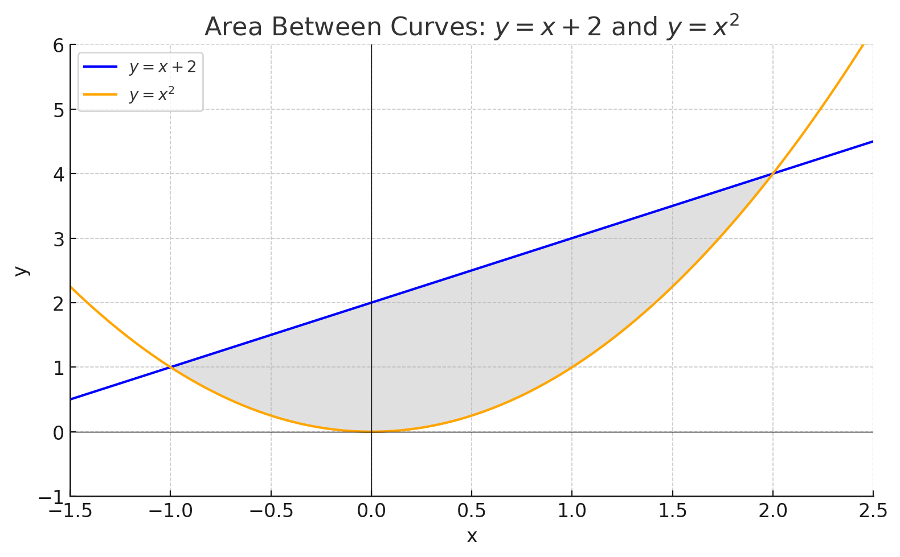
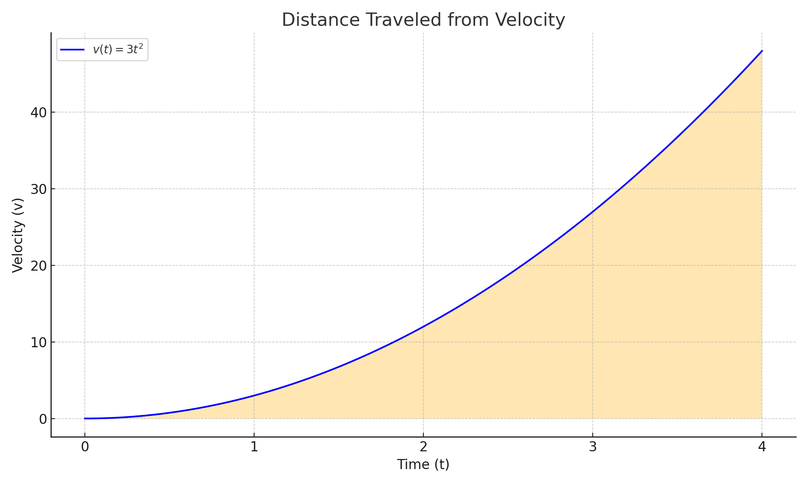
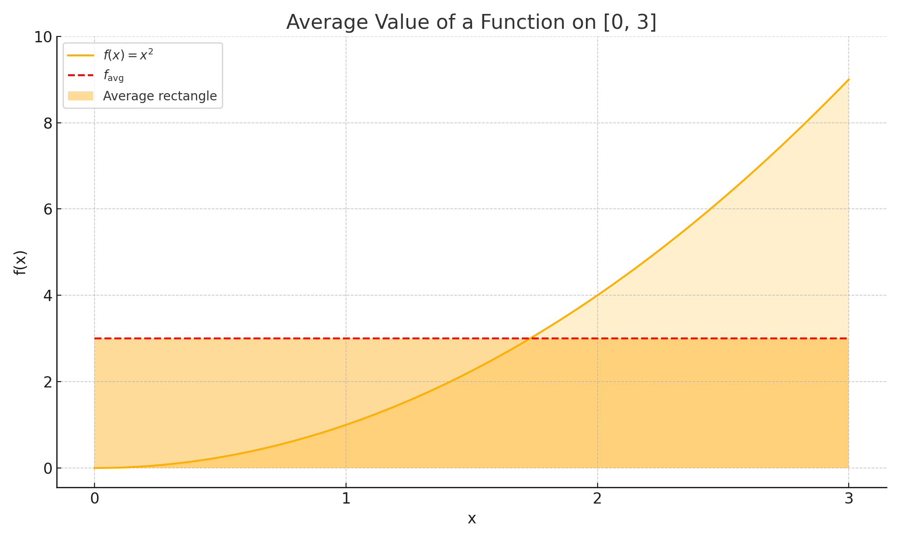
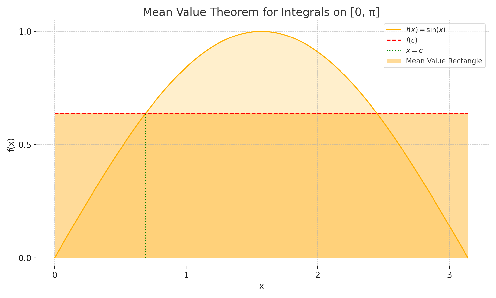

# Applications of Integration

### Key Ideas

- Integration lets us compute **net change** from a rate of change.
- Common applications include:
  - **Displacement and distance** from velocity
  - **Accumulated change** from a rate (e.g., population, volume, flow)
  - **Area** between curves
  - **Volume** of solids via slicing, disks, or shells
  - **Average value** of a function over an interval
  - **Work** and **center of mass** in physics contexts
- The Fundamental Theorem of Calculus connects **derivatives and integrals**, allowing us to evaluate accumulated quantities exactly.

---
## Area Between Curves

To find the area between two curves \(y = f(x)\) and \(y = g(x)\) on the interval \([a, b]\), where \(f(x) \ge g(x)\) for all \(x \in [a, b]\), we use:

$$
A = \int_a^b \bigl[f(x) - g(x)\bigr]\,dx
$$

<strong><u>Example:</u></strong> Find the area between $y = x + 2$ and $y = x^2$ on $[-1, 2]$

We have $A = \int_{-1}^{2} \bigl[(x + 2) - x^2\bigr]\,dx = \int_{-1}^{2} (-x^2 + x + 2)\,dx$. The antiderivative is $-\tfrac{x^3}{3} + \tfrac{x^2}{2} + 2x$. Evaluating:

- At $x = 2$: $-\tfrac{8}{3} + 2 + 4 = \tfrac{10}{3}$  
- At $x = -1$: $-\bigl(-\tfrac{1}{3}\bigr) + \tfrac{1}{2} - 2 = \tfrac{1}{3} + \tfrac{1}{2} - 2 = -\tfrac{7}{6}$  

So  
$A = \tfrac{10}{3} - \bigl(-\tfrac{7}{6}\bigr) = \tfrac{9}{2}$.

---
## Integrals and Distance

When a function represents **velocity**, **rate of change**, or **growth**, integration lets us compute:

- **Displacement** (net change)
- **Total distance traveled**
- **Accumulated quantity**

### Displacement

If $v(t)$ is the velocity of an object over time $t \in [a, b]$, then the **displacement** is:

$$
\int_a^b v(t) dt
$$

This is the **signed area** between the velocity curve and the time axis.

### Total Distance

To compute the **total distance traveled**, we integrate the **absolute value** of velocity:

$$
\int_a^b |v(t)| dt
$$

This gives the total area under the velocity curve, regardless of direction.

### Position from Velocity

If $s(t)$ is position and $s'(t) = v(t)$, then:

$$
s(b) - s(a) = \int_a^b v(t) dt
$$

So the definite integral recovers the net change in position from velocity.

Th

<strong><u>Example:</u></strong> A particle moves with velocity $v(t) = 3t^2 - 12t + 9$ on $[0, 4]$

**(a) Displacement**

Compute the definite integral:

$\int_0^4 (3t^2 - 12t + 9) dt = [t^3 - 6t^2 + 9t]_0^4$

Evaluate:

$(64 - 96 + 36) - 0 = 4$

So the **displacement** is 4 units.

**(b) Total Distance**

First, find where $v(t) = 0$:

$3t^2 - 12t + 9 = 0 \Rightarrow t = 1,\ 3$

Split the integral at those points:

$\int_0^4 |v(t)| dt = \int_0^1 v(t) dt - \int_1^3 v(t) dt + \int_3^4 v(t) dt$

Compute each:

- $\int_0^1 v(t) dt = [t^3 - 6t^2 + 9t]_0^1 = 4$
- $\int_1^3 v(t) dt = [t^3 - 6t^2 + 9t]_1^3 = -4$
- $\int_3^4 v(t) dt = [t^3 - 6t^2 + 9t]_3^4 = 4$

Add absolute values: $4 + 4 + 4 = 12$

**Total distance traveled** is 12 units.

---

## Average Value of a Function

If a function is continuous on the interval $[a, b]$, then its **average value** is:

$$
f_{\text{avg}} = \frac{1}{b - a} \int_a^b f(x)\,dx
$$

This gives the height of a rectangle with base $b - a$ and the **same area** as the region under the curve $y = f(x)$ from $x = a$ to $x = b$.

<strong><u>Example:</u></strong> Find the average value of $f(x) = x^2$ on $[0, 3]$

We compute:  
$f_{\text{avg}} = \frac{1}{3 - 0} \int_0^3 x^2\,dx = \frac{1}{3} \left[\frac{x^3}{3}\right]_0^3$

Evaluate:  
$\frac{1}{3} \left(\frac{27}{3} - 0\right) = \frac{1}{3} \cdot 9 = 3$

So the average value is **3**.

---
## Mean Value Theorem for Integrals

If a function $f(x)$ is continuous on the interval $[a, b]$, then there exists at least one point $c \in [a, b]$ such that:

$$
\int_a^b f(x)\,dx = f(c)(b - a)
$$

This means the total area under the curve equals the area of a rectangle with width $b - a$ and height $f(c)$.

<strong><u>Example:</u></strong> Apply the theorem to $f(x) = \cos x$ on $[0, \pi/2]$

We compute the average value:  
$f_{\text{avg}} = \frac{1}{\pi/2 - 0} \int_0^{\pi/2} \cos x\,dx = \frac{2}{\pi} [\sin x]_0^{\pi/2} = \frac{2}{\pi}$

So there exists $c \in [0, \pi/2]$ such that $f(c) = \frac{2}{\pi}$.

That is, $\cos(c) = \frac{2}{\pi} \Rightarrow c = \cos^{-1}\left(\frac{2}{\pi}\right) \approx 0.88$

