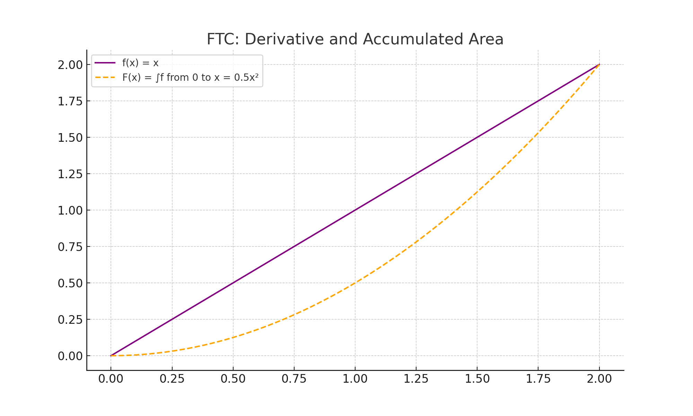

# Integrals

### Key Ideas

- An **antiderivative** of a function $f$ is a function $F$ such that $F'(x) = f(x)$.
- The **area under a curve** between $a$ and $b$ can be approximated by Riemann sums and computed exactly by a **definite integral**.
- Integrals can also represent **net change** in position, velocity, or accumulation.

---
## Antiderivatives

An **antiderivative** reverses differentiation. If $F'(x) = f(x)$, then $F$ is called an **antiderivative** of $f$.

Antiderivatives are **not unique**: if $F(x)$ is an antiderivative of $f(x)$, then so is $F(x) + C$ for any constant $C$. This constant accounts for the “unknown” vertical shift when reversing a derivative.

The general form of the **indefinite integral** is:

$$
\int f(x)\, dx = F(x) + C
$$

where:
- $\int$ is the **integral sign**
- $f(x)$ is the **integrand**
- $dx$ indicates the variable of integration
- $C$ is the **constant of integration**

### Basic Antiderivative Rules

| Function $f(x)$              | Antiderivative $\int f(x)\, dx$                  |
|-----------------------------|--------------------------------------------------|
| $x^n$ (for $n \ne -1$)      | $\dfrac{x^{n+1}}{n+1} + C$                        |
| $\dfrac{1}{x}$              | $\ln \|x\| + C$                                   |
| $\sin x$                    | $-\cos x + C$                                     |
| $\cos x$                    | $\sin x + C$                                      |
| $\sec^2 x$                  | $\tan x + C$                                      |
| $\csc^2 x$                  | $-\cot x + C$                                     |
| $\sec x \tan x$             | $\sec x + C$                                      |
| $\csc x \cot x$             | $-\csc x + C$                                     |
| $e^x$                       | $e^x + C$                                         |
| $a^x$                       | $\dfrac{a^x}{\ln a} + C$ ($a > 0$, $a \ne 1$)     |

<strong><u>Examples:</u></strong>

- $\int x^2\, dx = \dfrac{x^3}{3} + C$
- $\int \cos x\, dx = \sin x + C$
- $\int \dfrac{1}{x}\, dx = \ln|x| + C$
- $\int e^x\, dx = e^x + C$
- $\int 4x^3 - \sin x + \dfrac{1}{x}\, dx = x^4 + \cos x + \ln|x| + C$

### Graphical Insight

Antiderivatives correspond to **families of functions** that differ only by vertical shifts.

If $f(x) = 2x$, then the antiderivative is $F(x) = x^2 + C$, which produces a **family of parabolas**. Each value of $C$ shifts the graph up or down.

### Why the Constant of Integration?

When taking derivatives, all constants vanish (since the derivative of a constant is 0). Therefore, when going in reverse, we can’t know what constant might have been present — so we include $+C$ to represent **all possible antiderivatives**.

<strong><u>Example:</u></strong> Why is $F(x) = x^2 + 7$ also an antiderivative of $f(x) = 2x$?

Because:

$F'(x) = \dfrac{d}{dx}(x^2 + 7) = 2x = f(x)$

So both $x^2 + 7$ and $x^2 + 100$ are valid antiderivatives of $2x$

### Antiderivative Notation

- $\int f(x)\, dx$ is called the **indefinite integral**
- It represents the **set of all antiderivatives** of $f$
- No upper or lower limits are specified

> This is in contrast to a **definite integral**, which evaluates to a number and represents **net area** under a curve.

---
## Riemann Sums

To approximate the area under a curve on the interval $[a, b]$, divide it into $n$ equal subintervals of width $\Delta x = \frac{b - a}{n}$.

Each method uses sample points in different parts of the subinterval:

---

### Left Riemann Sum

Uses left endpoints:

$$
L_n = \sum_{i = 0}^{n - 1} f(x_i)\, \Delta x
$$

### Right Riemann Sum

Uses right endpoints:

$$
R_n = \sum_{i = 1}^{n} f(x_i)\, \Delta x
$$

### Midpoint Riemann Sum

Uses midpoints of each subinterval:

$$
M_n = \sum_{i = 1}^{n} f\left(\frac{x_{i - 1} + x_i}{2}\right)\Delta x
$$

### Trapezoidal Rule

Approximates area using trapezoids:

$$
T_n = \frac{\Delta x}{2} \left[ f(x_0) + 2f(x_1) + 2f(x_2) + \dots + 2f(x_{n - 1}) + f(x_n) \right]
$$

### Simpson’s Rule

Uses parabolic arcs (requires even $n$):

$$
S_n = \frac{\Delta x}{3} \left[ f(x_0) + 4f(x_1) + 2f(x_2) + \dots + 4f(x_{n - 1}) + f(x_n) \right]
$$

### Summation Formulas

Useful for calculating exact sums in Riemann expressions:

- $\sum_{i=1}^n i = \frac{n(n+1)}{2}$
- $\sum_{i=1}^n i^2 = \frac{n(n+1)(2n+1)}{6}$
- $\sum_{i=1}^n i^3 = \left(\frac{n(n+1)}{2}\right)^2$

<strong><u>Example 1:</u></strong> Left sum for $f(x) = x^2$ on $[1, 3]$ with $n = 4$

$\Delta x = \frac{3 - 1}{4} = 0.5$.

Left endpoints are $x_0 = 1$, $x_1 = 1.5$, $x_2 = 2$, and $x_3 = 2.5$.

Then  
$L_4 = \sum_{i = 0}^{3} f(x_i)\,\Delta x = \bigl[f(1) + f(1.5) + f(2) + f(2.5)\bigr]\,(0.5) = (1 + 2.25 + 4 + 6.25)\times 0.5 = 6.75$.

<strong><u>Example 2:</u></strong> Right sum for $f(x) = \sqrt{x}$ on $[1, 5]$ with $n = 2$

$\Delta x = 2$

Right endpoints: $x_1 = 3$, $x_2 = 5$

$R_2 =   = (\sqrt{3} + \sqrt{5})(2) \approx (1.732 + 2.236)(2) = 3.968$

<strong><u>Example 3:</u></strong> Trapezoidal approximation for $f(x) = x^2$ on $[0, 2]$, $n = 4$

$\Delta x = 0.5$

$x_0 = 0,\ x_1 = 0.5,\ x_2 = 1,\ x_3 = 1.5,\ x_4 = 2$

$T_4 = \frac{0.5}{2} [f(0) + 2f(0.5) + 2f(1) + 2f(1.5) + f(2)]$  
$= 0.25[0 + 2(0.25) + 2(1) + 2(2.25) + 4] = 0.25(11) = 2.75$

---
## Definite Integrals

A **definite integral** computes the signed area under a curve between two points.

### Definition

If $f$ is continuous on $[a, b]$, the **definite integral** of $f$ from $a$ to $b$ is:

$$
\int_a^b f(x)\, dx = \lim_{n \to \infty} \sum_{i=1}^n f(x_i^*)\, \Delta x
$$

Where:

- $[a, b]$ is partitioned into $n$ subintervals
- $\Delta x = \frac{b - a}{n}$
- $x_i^*$ is a sample point in the $i$th subinterval

This limit of Riemann sums gives the **exact signed area** under $f(x)$ on $[a, b]$.

### Properties of Definite Integrals

Let $f$ and $g$ be integrable on $[a, b]$, and let $c$ be a constant:

- $\int_a^a f(x)\, dx = 0$
- $\int_a^b f(x)\, dx = -\int_b^a f(x)\, dx$
- $\int_a^b [f(x) + g(x)]\, dx = \int_a^b f(x)\, dx + \int_a^b g(x)\, dx$
- $\int_a^b c \cdot f(x)\, dx = c \int_a^b f(x)\, dx$
- $\int_a^c f(x)\, dx + \int_c^b f(x)\, dx = \int_a^b f(x)\, dx$

<strong><u>Example:</u></strong> Compute $\int_1^4 (2x + 3)\, dx$

Use antiderivatives:

$\int_1^4 (2x + 3)\, dx = \left[x^2 + 3x\right]_1^4 = (16 + 12) - (1 + 3) = 28$

<strong><u>Example:</u></strong> Compute $\int_0^2 x^2\, dx$ using a Riemann sum

Use right endpoints:

$\Delta x = \frac{2 - 0}{n} = \frac{2}{n}$  
$x_i = \frac{2i}{n}$

Riemann sum:

$\sum_{i=1}^n \left(\frac{2i}{n}\right)^2 \cdot \frac{2}{n} = \frac{8}{n^3} \sum_{i=1}^n i^2$

Use formula: $\sum_{i=1}^n i^2 = \frac{n(n + 1)(2n + 1)}{6}$

Final result:

$\int_0^2 x^2\, dx = \lim_{n \to \infty} \frac{8}{n^3} \cdot \frac{n(n + 1)(2n + 1)}{6} = \frac{8}{6} = \frac{4}{3}$

### Geometric Interpretation

The value of a definite integral can often be found using geometry:

- Area of a rectangle: $A = bh$
- Area of a triangle: $A = \frac{1}{2}bh$
- Area of a semicircle: $A = \frac{1}{2}\pi r^2$

<strong><u>Example:</u></strong> Find $\int_{-2}^2 \sqrt{4 - x^2}\, dx$

This is the top half of a circle of radius 2.

Area = $\frac{1}{2} \pi (2)^2 = 2\pi$

---

## Fundamental Theorem of Calculus

The **Fundamental Theorem of Calculus (FTC)** connects **integration** and **differentiation**, showing they are inverse processes.

### Part 1: Evaluation Formula

If $f$ is continuous on $[a, b]$ and $F$ is any antiderivative of $f$, then:

$$
\int_a^b f(x)\, dx = F(b) - F(a)
$$

This lets us compute exact areas using antiderivatives.

<strong><u>Example:</u></strong> Evaluate $\int_0^3 (4x - 1)\, dx$

Let $F(x) = 2x^2 - x$

Then:

$F(3) - F(0) = (18 - 3) - (0) = 15$

<strong><u>Example:</u></strong> Evaluate $\int_1^e \frac{1}{x}\, dx$

Antiderivative: $F(x) = \ln|x|$

Then:

$\ln e - \ln 1 = 1 - 0 = 1$

### Part 2: Derivative of the Integral

If $f$ is continuous on $[a, b]$ and:

$$
F(x) = \int_a^x f(t)\, dt
$$

then $F'(x) = f(x)$

So the derivative of the **accumulated area function** recovers the original function.

<strong><u>Example:</u></strong> Let $F(x) = \int_1^x \cos t\, dt$. Find $F'(x)$

By FTC Part 2:

$F'(x) = \cos x$

<strong><u>Example:</u></strong> Let $G(x) = \int_2^{x^2} \sqrt{1 + t^4}\, dt$

Apply chain rule:

$G'(x) = \sqrt{1 + (x^2)^4} \cdot 2x = \sqrt{1 + x^8} \cdot 2x$

---

## U-Substitution

U-substitution is the reverse of the chain rule. It allows us to simplify integrals by changing variables.

### Strategy

1. Identify an inner function $u = g(x)$  
2. Compute $\displaystyle \frac{du}{dx}$ and solve for $dx$  
3. Rewrite the integral in terms of $u$  
4. Integrate with respect to $u$  
5. Substitute back $u = g(x)$  

### Formula

If $u = g(x)$ and $f$ is continuous, then

$$
\int f\bigl(g(x)\bigr) g'(x)dx = \int f(u) du
$$

### Indefinite Example

<strong><u>Example:</u></strong> Compute $\int 2x \cos(x^2)\,dx$

Let $u = x^2$, so $du = 2x\,dx$.

$$
\int 2x \cos(x^2)\,dx 
= \int \cos(u)\,du
= \sin(u) + C
= \sin(x^2) + C
$$

### Definite Example

<strong><u>Example:</u></strong> Compute $\int_0^1 x e^{x^2}\,dx$

Let $u = x^2$, then $du = 2x\,dx$ so $\tfrac12\,du = x\,dx$.

Change limits:  
- When $x = 0$, $u = 0$  
- When $x = 1$, $u = 1$  

$$
\int_0^1 x e^{x^2}\,dx
= \int_0^1 e^u \,\frac12\,du
= \tfrac12 \int_0^1 e^u\,du
= \tfrac12\bigl(e - 1\bigr)
$$

### When to Use

Use u-substitution when:

- The integrand is a composition $f(g(x))$  
- You spot a function and its derivative (or a constant multiple thereof)

---

## Josh’s Notes

- **Antiderivatives are families**: When you take an antiderivative, you’re not just getting a function — you’re getting a whole set of functions that differ by a constant. Always include “+ C”.
- **Definite integrals give numbers**: No "+ C" needed — you're measuring exact area (net or total), not a family.
- **Riemann sums build the intuition**: All those rectangles help you see that integration is just fancy area calculation. But formulas like Simpson’s Rule are much more efficient.
- **FTC is the bridge**: The Fundamental Theorem of Calculus connects accumulation and change. If you understand both parts, you understand integration.
- **Signed vs. total area**: Don’t confuse displacement (can be zero) with distance (always positive). Use absolute values to get total distance.
- **Use substitution when you spot the chain rule** in reverse — think: "Is this a derivative of something inside something?"
- **Definite integrals and substitution**: Don’t forget to change the limits! That’s what makes substitution clean and avoids undoing the whole thing.
- **Integration is pattern recognition**: The more antiderivatives you memorize and practice, the faster you’ll spot structure.

> When stuck: Ask yourself, “Is this a derivative I’ve seen before — maybe inside something else?”
