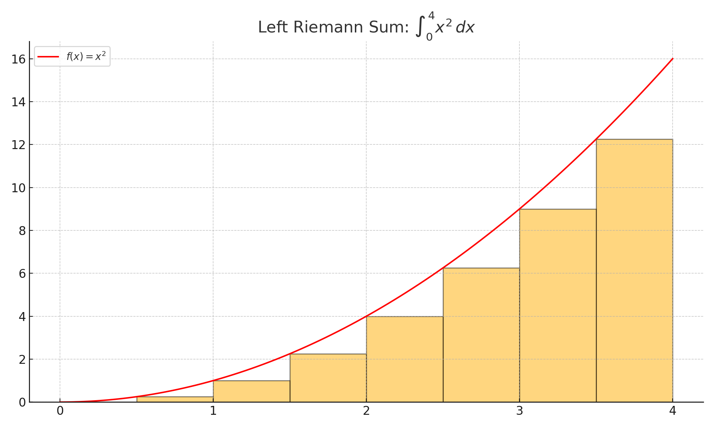

# Integrals

## Antiderivatives, Areas, & Distances

### Key Ideas

- An **antiderivative** of a function $f$ is a function $F$ such that $F'(x) = f(x)$.
- The **area under a curve** between $a$ and $b$ can be approximated by Riemann sums and computed exactly by a **definite integral**.
- Integrals can also represent **net change** in position, velocity, or accumulation.

---

### Antiderivatives

An **antiderivative** reverses differentiation. If $F'(x) = f(x)$, then $F$ is an antiderivative of $f$.

The general form is:

$$
\int f(x)\, dx = F(x) + C
$$

where $C$ is the **constant of integration**.

<strong><u>Examples:</u></strong>

- $\int x^2\, dx = \dfrac{x^3}{3} + C$
- $\int \cos x\, dx = \sin x + C$
- $\int \dfrac{1}{x}\, dx = \ln|x| + C$

---

### Area Under a Curve

To approximate the area under a curve, we divide the interval $[a, b]$ into $n$ subintervals:

- Left endpoint approximation (LRAM)
- Right endpoint approximation (RRAM)
- Midpoint approximation (MRAM)
- Trapezoidal approximation

These are all forms of **Riemann sums**.

As $n \to \infty$, the Riemann sum becomes the **definite integral**:

$$
\int_a^b f(x)\, dx
$$

This gives the **exact area** under the curve from $x = a$ to $x = b$.

---

### Integrals and Distance

If $v(t)$ is the **velocity** of an object, then:

- **Displacement** from $t = a$ to $t = b$ is:  
  $$
  \int_a^b v(t)\, dt
  $$

- **Total distance traveled** is:  
  $$
  \int_a^b |v(t)|\, dt
  $$

These ideas show how integrals measure **accumulated change** — like total area, net motion, or growth.

