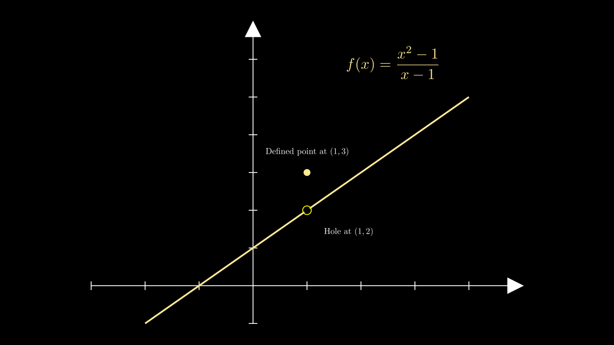

# Continuity

## Definition

A function is **continuous at a point** $x = a$ if:

1. $f(a)$ is defined  
2. $\lim_{x \to a} f(x)$ exists  
3. $\lim_{x \to a} f(x) = f(a)$

A function is **continuous on an interval** if it satisfies these conditions **at every point**.

Continuity is key to using powerful results like the **Intermediate Value Theorem (IVT)**.

---

## Continuity at a Point

A function is continuous at $x = a$ if the graph has **no holes, jumps, or vertical asymptotes** at that point.

This means:

- $f(a)$ is defined  
- $\lim_{x \to a} f(x)$ exists  
- $\lim_{x \to a} f(x) = f(a)$

<strong><u>Example:</u></strong> Is the function below continuous at $x = 2$?

Define $f(x)$ as:

- $f(x) = x^2$ if $x \ne 2$  
- $f(x) = 5$  if $x = 2$

Now check:

- $f(2) = 5$ (defined)  
- $\lim_{x \to 2} f(x) = 4$ (approaches $x^2$)  
- But $f(2) \ne \lim_{x \to 2} f(x)$

So $f$ is **not continuous** at $x = 2$ — this is a **removable discontinuity**.

---

## Types of Discontinuity

Discontinuities occur where a function is **not continuous**. The main types are:

### 1. Removable Discontinuity

A **hole** in the graph.  
The limit exists, but the function is either undefined or defined incorrectly.

**Example:**  
Let $f(x) = \dfrac{x^2 - 1}{x - 1}$  
This simplifies to $f(x) = x + 1$ for $x \ne 1$  
But $f(1)$ is undefined.  
→ Removable discontinuity at $x = 1$

### 2. Jump Discontinuity

The **left-hand and right-hand limits exist**, but they are **not equal**.  
The graph “jumps” from one value to another.

**Example:**  
Let:

- $f(x) = 3$ if $x < 0$  
- $f(x) = 1$ if $x \ge 0$

Then:

- $\lim_{x \to 0^-} f(x) = 3$  
- $\lim_{x \to 0^+} f(x) = 1$  
→ No single limit at $x = 0$ → jump discontinuity

### 3. Infinite Discontinuity

A **vertical asymptote** — the function grows without bound as it approaches a point.

**Example:**  
Let $f(x) = \dfrac{1}{x - 2}$  
As $x \to 2$, $f(x)$ goes to $\infty$ or $-\infty$  
→ Infinite discontinuity at $x = 2$

---

## Continuity on Intervals

A function is:

- **Continuous on an open interval** $(a, b)$ if it is continuous at every point between $a$ and $b$.
- **Continuous on a closed interval** $[a, b]$ if:
  - It is continuous on $(a, b)$, and
  - $\lim_{x \to a^+} f(x) = f(a)$ (right-hand limit at $a$ exists and equals $f(a)$)
  - $\lim_{x \to b^-} f(x) = f(b)$ (left-hand limit at $b$ exists and equals $f(b)$)

This distinction is important for applying theorems like the **Intermediate Value Theorem**.

---

## Intermediate Value Theorem (IVT)

If a function $f$ is **continuous on a closed interval** $[a, b]$, and $N$ is any number between $f(a)$ and $f(b)$,  
then there exists at least one $c \in (a, b)$ such that:

$$
f(c) = N
$$

The IVT guarantees that a continuous function **hits every value** between its endpoints.

---

<strong><u>Example:</u></strong> Show that $f(x) = x^3 - x - 2$ has a root in $[1, 2]$

Check values:

- $f(1) = 1 - 1 - 2 = -2$
- $f(2) = 8 - 2 - 2 = 4$

Since $0$ is between $-2$ and $4$, and $f$ is continuous,  
→ by IVT there exists $c \in (1, 2)$ such that $f(c) = 0$

## Practice Problems

1. Determine if each function is continuous at the given point:

   a. $f(x) = \frac{x^2 - 1}{x - 1}$ at $x = 1$  
   b. $f(x) = \sqrt{x - 2}$ at $x = 2$  
   c. $f(x) = \frac{1}{x - 3}$ at $x = 3$

2. State the type of discontinuity (if any):

   $f(x) = \frac{|x|}{x}$ at $x = 0$

3. Use the Intermediate Value Theorem to justify whether a root exists in the given interval:

   a. $f(x) = x^3 + x - 4$ on $[1, 2]$  
   b. $f(x) = \ln x - x + 2$ on $[1, 3]$

## Josh’s Tip

> Discontinuities are where a function “breaks its promise.”

When you're checking continuity, always ask:

- Is the function **defined** at that point?
- Do the **left and right limits match**?
- Does the **function’s value match the limit**?

If not — identify the **type** of discontinuity:
- Hole? → Removable  
- Jump? → Step or piecewise  
- Infinite? → Asymptote

Also, don’t forget:
- The **Intermediate Value Theorem** only works on **continuous** functions.
- Visualize it! Most continuity questions become easier once you **sketch the graph**.
