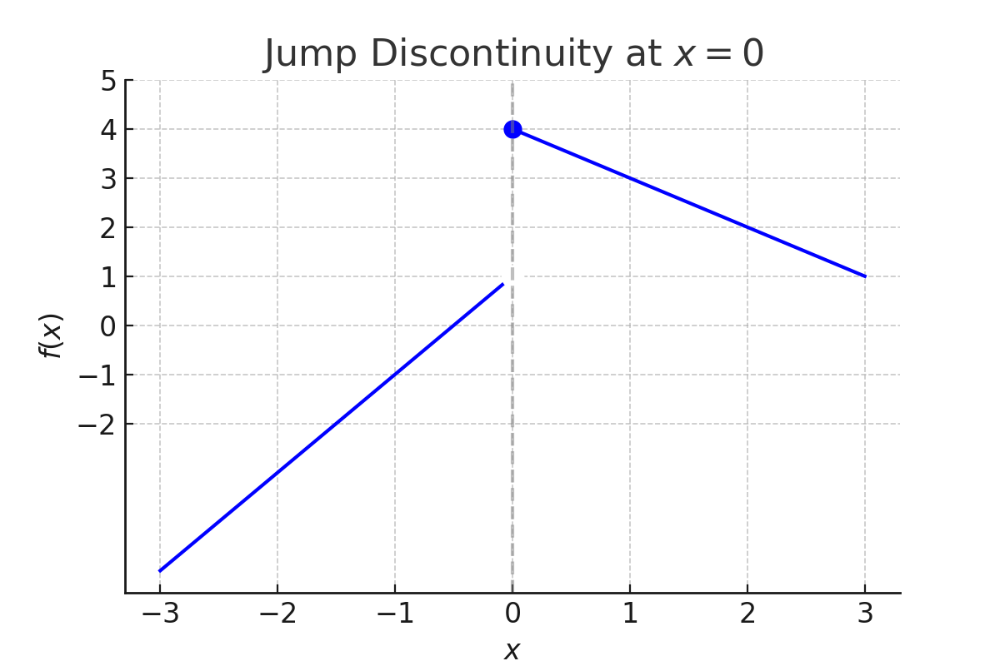
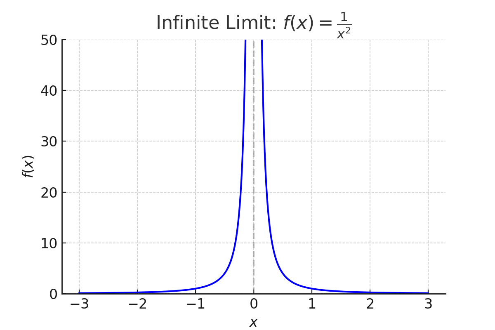
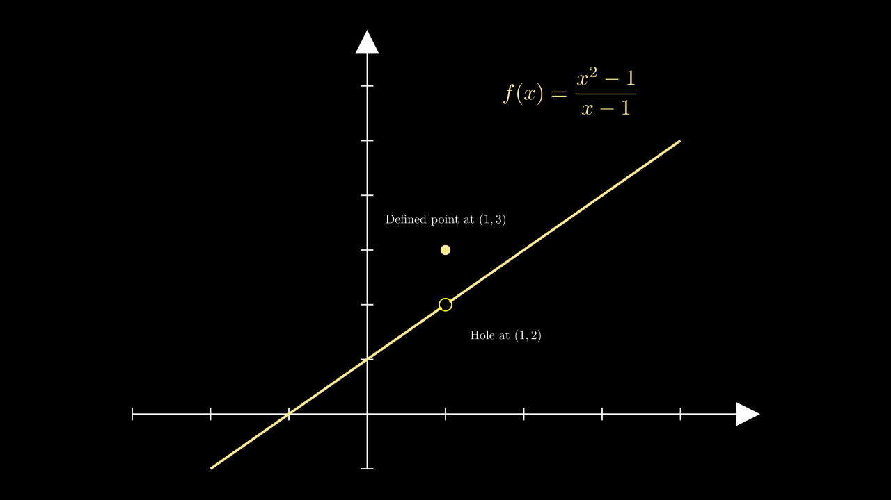

# Limits and Continuity

## Key Ideas

- The **limit** of a function describes its behavior as the input approaches a certain value.
- Limits may exist even when the function is **not defined** at that point.
- A function is **continuous** at $x = a$ if:
  1. $f(a)$ is defined  
  2. $\lim_{x \to a} f(x)$ exists  
  3. $\lim_{x \to a} f(x) = f(a)$

---

## One-Sided Limits and Jump Discontinuity

If the left- and right-hand limits exist but are not equal, the limit does **not exist** at that point.  
This is called a **jump discontinuity**.

---

## Infinite Limits

As $x$ approaches a value, the function might grow arbitrarily large.  
This creates a **vertical asymptote**.

**Example**: $f(x) = \frac{1}{x^2}$

---

## Removable Discontinuity

A function has a **removable discontinuity** if the limit exists, but the function is either undefined or redefined at that point.

**Example**:  
The function  
$$f(x) = \frac{x^2 - 1}{x - 1}$$  
has a hole at $x = 1$, since the expression is undefined there.

If we define:  
$$f(1) = 3$$  
we introduce a **removable discontinuity**.

---

## Tutor’s Tip

Before applying calculus techniques, always ask:

- What’s happening **as you approach** the point?
- Does the function actually exist **at** that point?
- Are both sides approaching the **same** value?

Limits bridge algebra and calculus. Use **graphs**, **tables**, and **symbolic methods** together for deep understanding.
