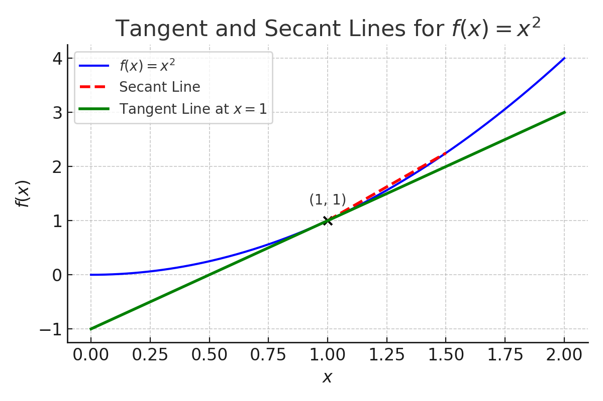
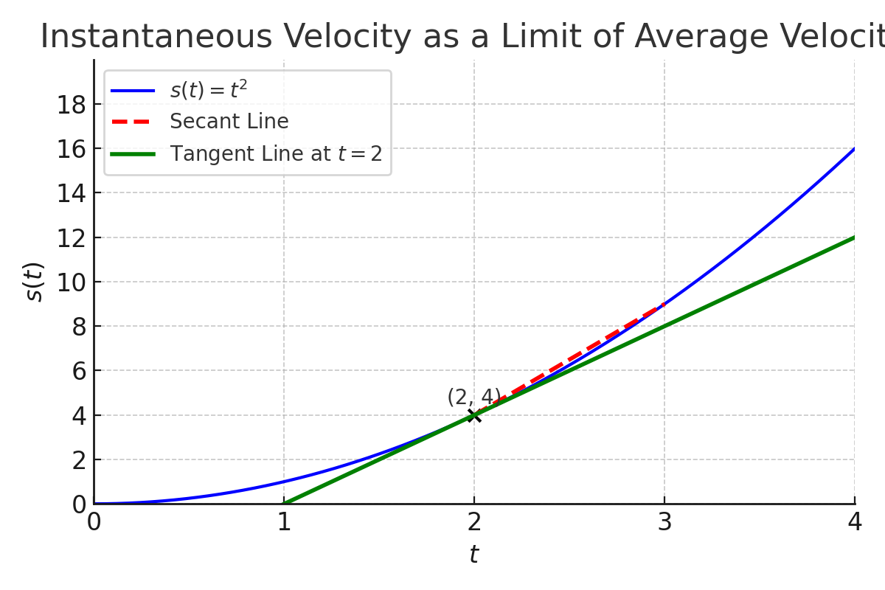
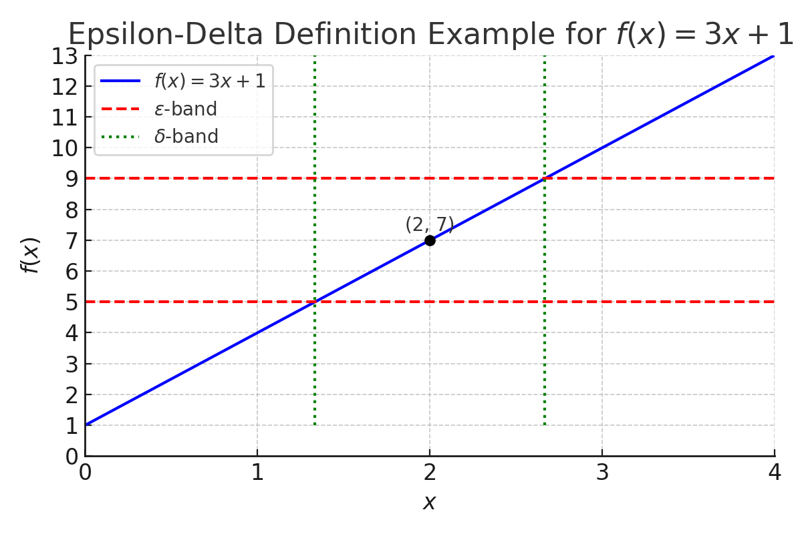

# Limits

## Key Ideas

Limits describe what a function is **approaching**, not necessarily what it equals.

They help us:

* Define **instantaneous rate of change**
* Handle **undefined expressions**
* Understand **continuity**, **derivatives**, and **integrals**

A proper grasp of limits is the **gateway to calculus**.

---

## The Tangent and Velocity Problems

Limits help us define ideas that involve **instantaneous change**, like slopes and velocities.

---

### The Tangent Problem

To find the slope of a **tangent line**, we approximate using **secant lines** and then take a limit.

Let $f(x) = x^2$, and consider:

$$
\text{Slope of secant from } x = 1 \text{ to } x = 1 + h:\quad \frac{f(1 + h) - f(1)}{h}
$$

The **slope of the tangent** is:

$$
\lim_{h \to 0} \frac{(1 + h)^2 - 1}{h} = \lim_{h \to 0} \frac{2h + h^2}{h} = \lim_{h \to 0} (2 + h) = 2
$$

<strong><u>Example:</u></strong> Find the slope of the tangent line to $f(x) = x^2$ at $x = 3$

Use the limit:

$\displaystyle \lim_{h \to 0} \frac{(3 + h)^2 - 9}{h} = \frac{9 + 6h + h^2 - 9}{h} = \frac{6h + h^2}{h} = 6 + h \Rightarrow \boxed{6}$

---

### The Velocity Problem

If $s(t)$ is the position of an object at time $t$:

- **Average velocity** on $[t, t + h]$ is:

$$
\frac{s(t + h) - s(t)}{h}
$$

- **Instantaneous velocity** at $t$ is:

$$
\lim_{h \to 0} \frac{s(t + h) - s(t)}{h}
$$

<strong><u>Example:</u></strong> An object moves along $s(t) = t^2$. Find its instantaneous velocity at $t = 4$

Use:

$\displaystyle \lim_{h \to 0} \frac{(4 + h)^2 - 16}{h} = \frac{16 + 8h + h^2 - 16}{h} = 8 + h \Rightarrow \boxed{8}$

---

## The Limit of a Function

The notation:

$$
\lim_{x \to a} f(x) = L
$$

means the values of $f(x)$ can be made arbitrarily close to $L$ by taking $x$ sufficiently close (but not equal) to $a$.

---

A limit **exists** only if:

$$
\lim_{x \to a^-} f(x) = \lim_{x \to a^+} f(x) = L
$$

That is, the left-hand and right-hand limits must be equal.

---

<strong><u>Example:</u></strong> Evaluate $\lim_{x \to 2} \frac{x^2 - 4}{x - 2}$

Factor the numerator:

$\frac{x^2 - 4}{x - 2} = \frac{(x - 2)(x + 2)}{x - 2}$

Cancel $(x - 2)$:

$f(x) = x + 2$ for $x \ne 2$

Then:

$\lim_{x \to 2} f(x) = 2 + 2 = \boxed{4}$

## Calculating Limits Using the Limit Laws

We can compute many limits using algebra and the following **limit laws**:

- **Sum Rule**:  
  $\lim_{x \to a} [f(x) + g(x)] = \lim_{x \to a} f(x) + \lim_{x \to a} g(x)$

- **Product Rule**:  
  $\lim_{x \to a} [f(x) \cdot g(x)] = \lim_{x \to a} f(x) \cdot \lim_{x \to a} g(x)$

- **Quotient Rule** (if $\lim g(x) \ne 0$):  
  $\lim_{x \to a} \frac{f(x)}{g(x)} = \frac{\lim f(x)}{\lim g(x)}$

- **Power Rule**:  
  $\lim_{x \to a} [f(x)]^n = [\lim_{x \to a} f(x)]^n$

- **Root Rule**:  
  $\lim_{x \to a} \sqrt[n]{f(x)} = \sqrt[n]{\lim_{x \to a} f(x)}$

---

<strong><u>Example 1:</u></strong> Evaluate $\lim_{x \to 3} (2x^2 - x + 5)$

Apply limit directly:

$2(3)^2 - 3 + 5 = 18 - 3 + 5 = \boxed{20}$

<strong><u>Example 2:</u></strong> Evaluate $\lim_{x \to 1} \frac{x^2 - 1}{x - 1}$

Factor the numerator:

$\frac{x^2 - 1}{x - 1} = \frac{(x - 1)(x + 1)}{x - 1}$

Cancel $(x - 1)$:

$f(x) = x + 1$ for $x \ne 1$

Then:

$\lim_{x \to 1} f(x) = \boxed{2}$

---

## The Precise Definition of a Limit

We say:

$$
\lim_{x \to a} f(x) = L
$$

if for every $\varepsilon > 0$, there exists $\delta > 0$ such that:

$$
0 < |x - a| < \delta \quad \Rightarrow \quad |f(x) - L| < \varepsilon
$$

This formalizes the idea of "getting arbitrarily close."

---

<strong><u>Example:</u></strong> Prove $\lim_{x \to 2} (3x + 1) = 7$ using the $\varepsilon$ - $\delta$ definition

Let $\varepsilon > 0$. We want to find $\delta > 0$ such that:

$0 < |x - 2| < \delta \Rightarrow |(3x + 1) - 7| < \varepsilon$

Simplify:

$|(3x + 1) - 7| = |3x - 6| = 3|x - 2|$

So we want:

$3|x - 2| < \varepsilon \Rightarrow |x - 2| < \frac{\varepsilon}{3}$

Set $\delta = \frac{\varepsilon}{3}$

Conclusion:

If $0 < |x - 2| < \delta$, then $|f(x) - 7| < \varepsilon$. So the limit is proven.

---
## Josh’s Tip

> Limits aren’t about plugging in numbers — they’re about understanding **behavior**.

Ask yourself:

* What is $f(x)$ **approaching** as $x$ gets close?
* Is the function **defined** there? Does it matter?
* Does the function behave the same from the **left and right**?

Sketch it. Factor it. Simplify it.

And when the question feels hard, remember: the limit just wants to know **where the function is going**, not where it lands.
