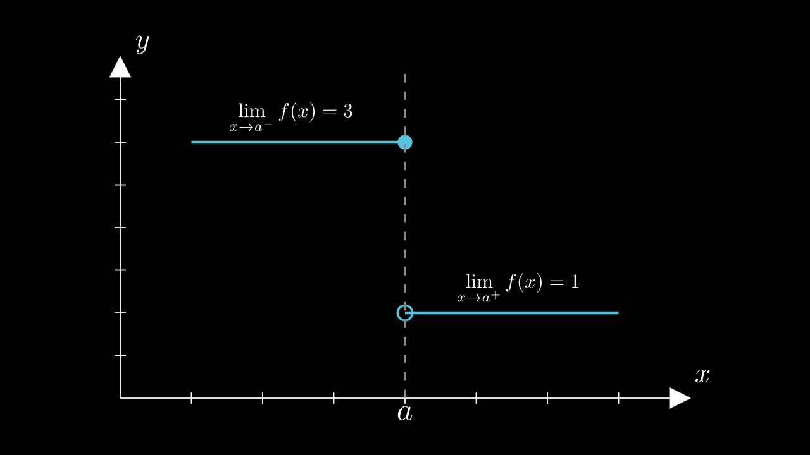
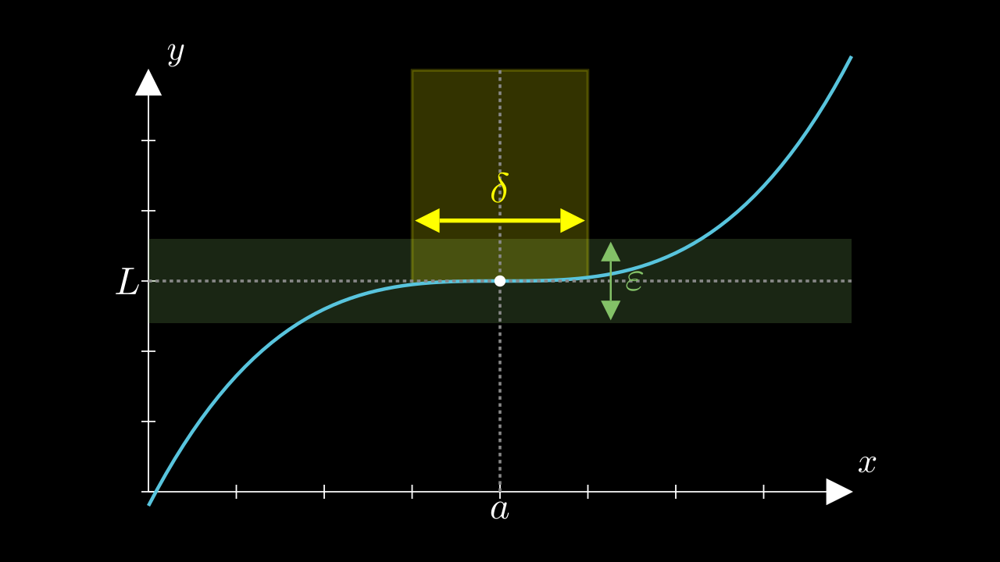

# Limits

## Key Ideas

Limits describe what a function is **approaching**, not necessarily what it equals. They help us:

- Evaluate **undefined expressions**
- Make sense of **holes** in graphs (removable discontinuities)
- Distinguish between **left-hand** and **right-hand** approaches
- Build the foundation for calculus

---

## What is a Limit?

The notation

$$
\lim_{x \to a} f(x) = L
$$

means that as $x$ gets close to $a$, $f(x)$ gets close to $L$.  
The limit is about **approach**, not necessarily what happens at $x = a$.

---

### One-Sided Limits

- **Left-hand limit:** $\lim_{x \to a^-} f(x)$
- **Right-hand limit:** $\lim_{x \to a^+} f(x)$

The two-sided limit exists **if and only if** the left- and right-hand limits are equal.

---

## How to Compute Limits

### 1. Direct Substitution

If $f(a)$ is defined and continuous, just plug in:

$$
\lim_{x \to 3} (2x^2 - x + 5) = 2(3)^2 - 3 + 5 = 20
$$

---

### 2. Algebraic Manipulation (Factoring and Canceling)

If direct substitution gives $0/0$, try to simplify:

<strong>Example:</strong> $\lim_{x \to 2} \dfrac{x^2 - 4}{x - 2}$

Factor the numerator:

$\frac{x^2 - 4}{x - 2} = \frac{(x-2)(x+2)}{x-2} = x + 2$ (for $x \neq 2$)

So:

$\lim_{x \to 2} \frac{x^2 - 4}{x - 2} = 2 + 2 = \boxed{4}$

---

### 3. One-Sided Limits & Jump Discontinuities

If $f(x)$ "jumps" at $x = a$, the limit may **not exist**.

<strong>Example:</strong> A jump discontinuity

$\lim_{x \to a^-} f(x) \ne \lim_{x \to a^+} f(x)$

**So $\lim_{x \to a} f(x)$ does not exist.**

---

### 4. Limit Laws

Limits can be computed using the following properties:

- **Sum Rule:**  
  $\lim_{x \to a}[f(x) + g(x)] = \lim_{x \to a} f(x) + \lim_{x \to a} g(x)$

- **Product Rule:**  
  $\lim_{x \to a}[f(x)g(x)] = \lim_{x \to a} f(x) \cdot \lim_{x \to a} g(x)$

- **Quotient Rule** (if denominator $\ne 0$):  
  $\lim_{x \to a} \frac{f(x)}{g(x)} = \frac{\lim_{x \to a} f(x)}{\lim_{x \to a} g(x)}$

- **Power Rule:**  
  $\lim_{x \to a} [f(x)]^n = [\lim_{x \to a} f(x)]^n$

- **Root Rule:**  
  $\lim_{x \to a} \sqrt[n]{f(x)} = \sqrt[n]{\lim_{x \to a} f(x)}$

---

### 5. The Precise ($\varepsilon$-$\delta$) Definition

We say

$$
\lim_{x \to a} f(x) = L
$$

if for every $\varepsilon > 0$ there exists $\delta > 0$ such that

$$
0 < |x-a| < \delta \implies |f(x) - L| < \varepsilon
$$

---

## Common Limit Behaviors

- **Removable Discontinuity:**  
  Limit exists, but $f(a)$ may be undefined or not equal to the limit.

- **Jump Discontinuity:**  
  Left and right limits exist but are not equal; the (two-sided) limit does not exist.

- **Infinite Limit:**  
  $f(x)$ increases or decreases without bound as $x$ approaches $a$.

---

## Josh’s Tips

> Don’t just “plug in”—think about what $f(x)$ is **approaching** as $x$ gets close to $a$.
>
> - Simplify when you get $0/0$
> - Check left and right sides if the function is “weird”
> - When in doubt, sketch the graph!

---

## Visual Index (for your notes)

- `limit.png`: General idea of a limit (approach, not value)
- `removable-discontinuity.png`: Hole in the graph
- `one-sided-limit.png`: Jump/one-sided limits
- `epsilon-delta.png`: Epsilon-delta definition

---
